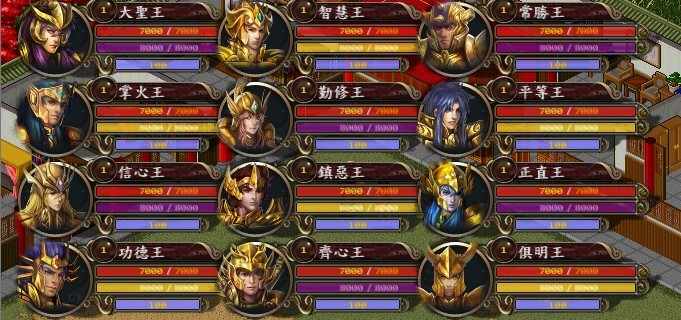

# Pig3 (金庸水浒传)

All heros in Kam Yung stories - 108 brothers and sisters

这是小小猪的第三部作品《金庸水浒传》的源代码。

## Pascal version

可以使用Lazarus或CodeTyphon编译。需从Pascal-Game-Development的页面找到SDL3的Pascal绑定，放在项目目录下的lib文件夹里。

Android版本需要先用CodeTyphon编译出so文件，再在SDL的java层调用。

## C++ version

几乎所有代码都是Github Copilot从Pascal版本翻译的，只有少量手工修正。目前没发现什么明显的bug，如果有的话也可以直接用AI参考Pascal版本修正。Android版可以直接用NDK来处理。

编译建议参考kys-pascal的说明，基本上是一样的。

## 资源文件

资源文件请在百度网盘，QQ群之类的地方下载。

图片文件的组织实际上与kys-cpp完全一致，故资源可以互相替换。但是目前kys-cpp已经开始高清化路线，故请酌情使用。

## 依赖库

基本上都是SDL，SDL-ttf，SDL-mixer，FFmpeg，Lua。因为实际只使用了PNG格式，故不再需要SDL-image。原用于音频播放的Bass已经移除，所以BASS的商业限制也不再是问题了。

## 其他

本工程实际上是kys-pascal（也叫kys-jedisdl）的衍生版本。但是中间经历了非常多的修改，因此现在已经很难说它们之间的关系了。总之，kys-pascal是这个项目的祖先。

本垃圾也曾经在这个游戏的制作中投入了大量精力，所以还是有一定感情的。希望它能给大家带来一些乐趣。

当年招募制作组的时候，很多人说不会Pascal。现在借助AI的帮助，将其完整转换过去，也算是了解了一件心事。不过这个游戏还会再更新吗？估计不会了吧。

## License

The codes are distributed under zlib license.

